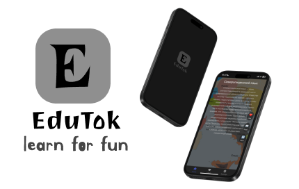

# EduTock  
[EN README](README.md) | [RU README](READMERU.md)  

  

## Обзор  

EduTock — это веб-приложение, которое предоставляет образовательный контент в коротком и увлекательном формате, вдохновленном такими популярными платформами, как TikTok. Оно позволяет пользователям быстро получать доступ к статьям из различных источников, включая Wikipedia, Habr и наш сайт SITeducation. Платформа создана для того, чтобы сделать обучение интересным и доступным.  

## Возможности  

- **Разнообразные источники контента**: Включает в себя статьи из Wikipedia, Habr и SITeducation.  
- **Настраиваемые параметры**:  
  - Выбор языка для статей Wikipedia.  
  - Опция показа или скрытия изображений в статьях.  
  - Функция автовоспроизведения для непрерывного потока контента.  
  - Выбор источника контента (Wikipedia, Habr, SITeducation или все сразу).  
- **Взаимодействие с пользователем**:  
  - Кнопка "Нравится" для сохранения избранных статей.  
  - Кнопка "Читать далее" для перехода к полной версии статьи.  
  - Кнопка "Далее" для загрузки нового контента.  
- **Функция свайпа**: Поддержка жестов (вверх/вниз) для навигации между статьями, что улучшает мобильный опыт.  

## Используемые технологии  

- **HTML**: Обеспечивает структуру приложения.  
- **CSS**: Стилизует интерфейс для привлекательного внешнего вида.  
- **JavaScript**: Реализует логику и интерактивность приложения.  

## Инструкции по установке  

Чтобы запустить EduTock локально, выполните следующие шаги:  

1. **Клонируйте репозиторий**:  
   ```bash  
   git clone https://github.com/ArduRadioKot/EduTok.git  
   cd EduTock  
   ```  

2. **Откройте `index.html` в браузере**:  
   Просто откройте файл `index.html` в современном браузере, чтобы начать пользоваться EduTock.  

## Установка как Веб приложение  

Чтобы установить EduTock как веб приложение:  

1. **Откройте сайт в поддерживаемом браузере** (например, Chrome, Safari).  
2. **Нажмите**: "Добавить в закладки".  
3. **Выберите**: "Добавить на главный экран".  

## Структура проекта  
```  
EduTock/  
├── index.html         # Основной HTML-файл  
├── script.js          # JavaScript-файл с логикой приложения  
├── styles.css         # CSS-файл для стилей  
├── manifest.json      # Манифест для PWA  
├── service-worker.js  # Сервис-воркер для PWA  
└── README.md          # Документация проекта  
```  

## Участие в разработке  

Мы приветствуем вклад в проект! Если вы хотите помочь в развитии EduTock, выполните следующие шаги:  

1. Сделайте форк репозитория.  
2. Создайте новую ветку для вашей функции или исправления.  
3. Внесите изменения и закоммитьте их с описательными сообщениями.  
4. Запушьте изменения в свой форк.  
5. Откройте pull request в основной репозиторий.  

## Лицензия  

Этот проект распространяется под лицензией [GPL-2.0](LICENSE).